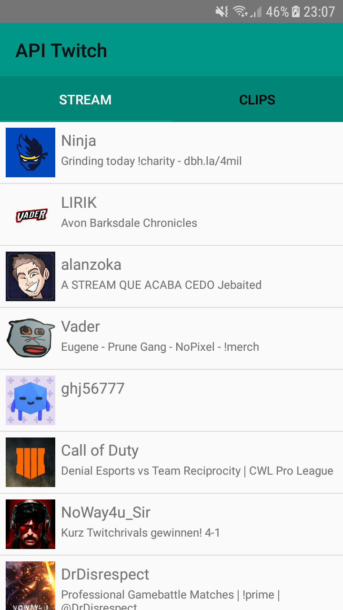
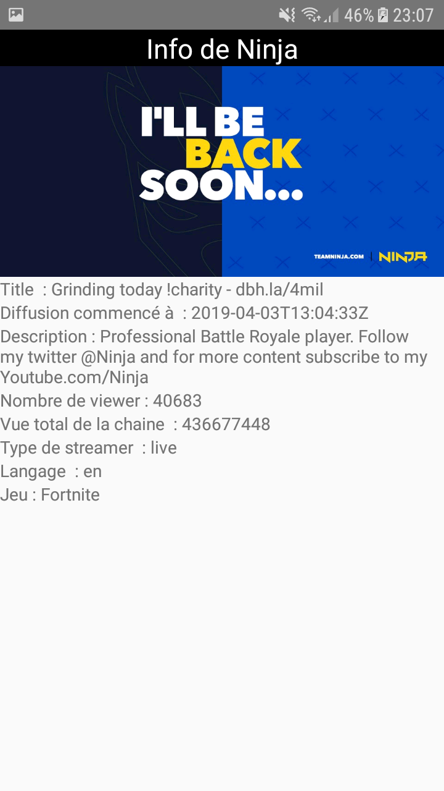
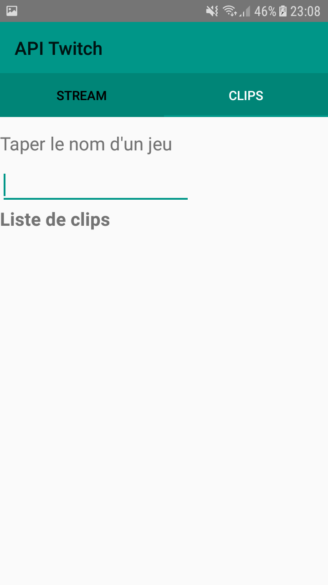
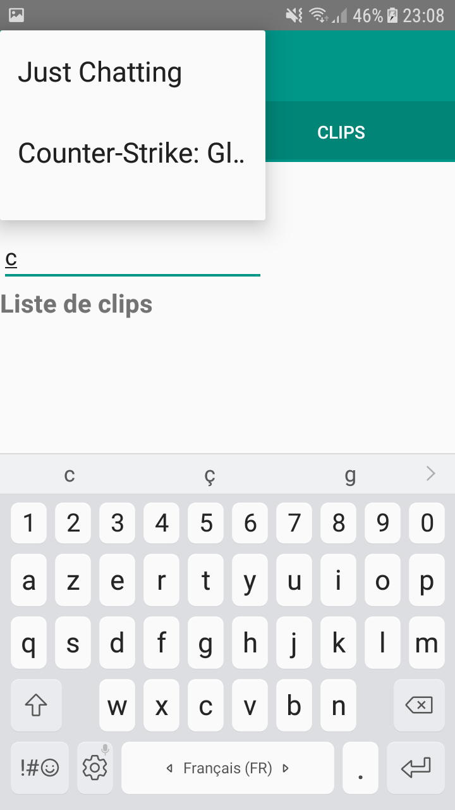
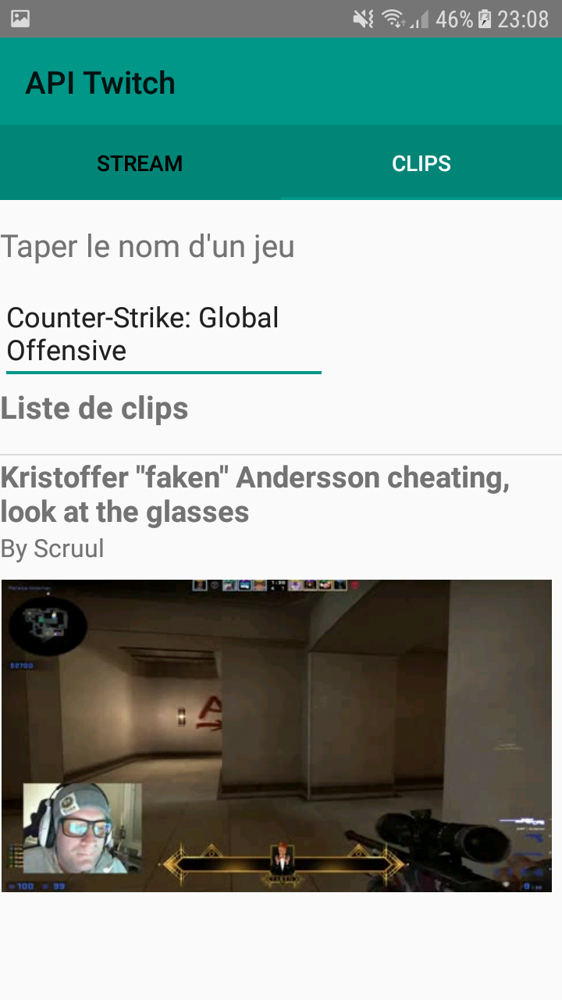

# Application API Twitch

## Présentation

Projet android utilisant une API REST (ici l'api twitch). Ce projet implémente le pattern MVC et un singleton dans l'interface service API.

Cette application affiche la liste des 20 premiers streamer sur twitch (Trié par ordre du nombre de spectateurs)

## Consignes respectées : 

- Architecture MVC
- Appels REST
- Ecrans : 2 activités
- Affichage d'une liste dans un RecyclerView (Liste de streamer)
- Affichage du détail d'un item de la liste
- Mise en cache de la liste de 20 streamers
- Transition entre les deux activités
- Fonctions supplémentaires :
	- Deux fragments
	- Rechercher un jeu avec de l'autocompletion (AutocompleteView)
	- Swipe possible entre les deux fragments (ViewPager)
	- Affichage de 20 clips dans un RecyclerView en fonction du jeu selectionné
	- Clic possible pour voir le clip en dehors de l'application (Sur Twitch si l'application est installé sinon sur un naviguateur)

## Fonctionnalités: 

### Première activité / premier fragment

- Liste des 20 streamers ordonné par nombre de spectateurs.

### Deuxième activité 

- Affichage des détails du stream sélectionné.

### Deuxieme fragment

- Barre de recherche de jeu avec autocompletion (100 jeux selectionnable correspondant aux plus vu sur Twitch)

 

- Affichage des clip en dessous après avoir cliquer sur un jeu dans la liste
- Affichage en premier du nom du clip suivi du pseudo de celui qui a clippé.

